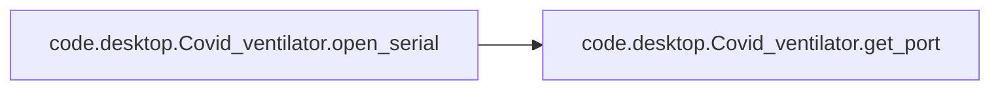
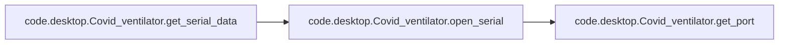

# Code Desktop

[_Documentation generated by Documatic_](https://www.documatic.com)

<!---Documatic-section-Codebase Structure-start--->
## Codebase Structure

<!---Documatic-block-system_architecture-start--->
```mermaid
None
```
<!---Documatic-block-system_architecture-end--->

# #
<!---Documatic-section-Codebase Structure-end--->

<!---Documatic-section-code.desktop.Covid_ventilator.get_port-start--->
## [code.desktop.Covid_ventilator.get_port](3-code_desktop.md#code.desktop.Covid_ventilator.get_port)

<!---Documatic-section-get_port-start--->
<!---Documatic-block-code.desktop.Covid_ventilator.get_port-start--->
<details>
	<summary><code>code.desktop.Covid_ventilator.get_port</code> code snippet</summary>

```python
def get_port():
    ports = serial.tools.list_ports.comports()
    for i in ports:
        i = str(i)
        if 'ACM' in i:
            return i.split()[0]
```
</details>
<!---Documatic-block-code.desktop.Covid_ventilator.get_port-end--->
<!---Documatic-section-get_port-end--->

# #
<!---Documatic-section-code.desktop.Covid_ventilator.get_port-end--->

<!---Documatic-section-code.desktop.Covid_ventilator.open_serial-start--->
## [code.desktop.Covid_ventilator.open_serial](3-code_desktop.md#code.desktop.Covid_ventilator.open_serial)

<!---Documatic-section-open_serial-start--->


### Object Calls

* [code.desktop.Covid_ventilator.get_port](3-code_desktop.md#code.desktop.Covid_ventilator.get_port)

<!---Documatic-block-code.desktop.Covid_ventilator.open_serial-start--->
<details>
	<summary><code>code.desktop.Covid_ventilator.open_serial</code> code snippet</summary>

```python
def open_serial():
    baudrate = 9600
    timeout = 5
    port = get_port()
    if port == None:
        return None
    else:
        ser = serial.Serial(port=port, baudrate=baudrate, timeout=timeout)
        if not ser.is_open:
            ser.open()
        return ser
```
</details>
<!---Documatic-block-code.desktop.Covid_ventilator.open_serial-end--->
<!---Documatic-section-open_serial-end--->

# #
<!---Documatic-section-code.desktop.Covid_ventilator.open_serial-end--->

<!---Documatic-section-code.desktop.Covid_ventilator.play_audio-start--->
## [code.desktop.Covid_ventilator.play_audio](3-code_desktop.md#code.desktop.Covid_ventilator.play_audio)

<!---Documatic-section-play_audio-start--->
<!---Documatic-block-code.desktop.Covid_ventilator.play_audio-start--->
<details>
	<summary><code>code.desktop.Covid_ventilator.play_audio</code> code snippet</summary>

```python
def play_audio(filename):
    filename = 'audio/' + filename
    wave_obj = sa.WaveObject.from_wave_file(filename)
    wave_obj.play()
```
</details>
<!---Documatic-block-code.desktop.Covid_ventilator.play_audio-end--->
<!---Documatic-section-play_audio-end--->

# #
<!---Documatic-section-code.desktop.Covid_ventilator.play_audio-end--->

<!---Documatic-section-code.desktop.Covid_ventilator.play_changed_data-start--->
## [code.desktop.Covid_ventilator.play_changed_data](3-code_desktop.md#code.desktop.Covid_ventilator.play_changed_data)

<!---Documatic-section-play_changed_data-start--->
<!---Documatic-block-code.desktop.Covid_ventilator.play_changed_data-start--->
<details>
	<summary><code>code.desktop.Covid_ventilator.play_changed_data</code> code snippet</summary>

```python
def play_changed_data(change='', value=0, unit=None):
    filename = 'audio/' + change + '.wav'
    wave_obj = sa.WaveObject.from_wave_file(filename)
    play_obj = wave_obj.play()
    play_obj.wait_done()
    filename = 'audio/' + str(value) + '.wav'
    wave_obj = sa.WaveObject.from_wave_file(filename)
    play_obj = wave_obj.play()
    play_obj.wait_done()
    if unit != None:
        filename = 'audio/' + str(unit) + '.wav'
        wave_obj = sa.WaveObject.from_wave_file(filename)
        play_obj = wave_obj.play()
        play_obj.wait_done()
    else:
        pass
```
</details>
<!---Documatic-block-code.desktop.Covid_ventilator.play_changed_data-end--->
<!---Documatic-section-play_changed_data-end--->

# #
<!---Documatic-section-code.desktop.Covid_ventilator.play_changed_data-end--->

<!---Documatic-section-code.desktop.Covid_ventilator.send_sms-start--->
## [code.desktop.Covid_ventilator.send_sms](3-code_desktop.md#code.desktop.Covid_ventilator.send_sms)

<!---Documatic-section-send_sms-start--->
<!---Documatic-block-code.desktop.Covid_ventilator.send_sms-start--->
<details>
	<summary><code>code.desktop.Covid_ventilator.send_sms</code> code snippet</summary>

```python
def send_sms(sms_body='', to_number='+TO_YOUR_NUMBER'):
    account_sid = 'YOUR_TWILIO_SID'
    auth_token = 'YOUR_TOKEN'
    client = Client(account_sid, auth_token)
    client.messages.create(body=sms_body, from_='+FROM_YOUR_TWILIO_NUMBER', to=to_number)
```
</details>
<!---Documatic-block-code.desktop.Covid_ventilator.send_sms-end--->
<!---Documatic-section-send_sms-end--->

# #
<!---Documatic-section-code.desktop.Covid_ventilator.send_sms-end--->

<!---Documatic-section-code.desktop.Covid_ventilator.get_serial_data-start--->
## [code.desktop.Covid_ventilator.get_serial_data](3-code_desktop.md#code.desktop.Covid_ventilator.get_serial_data)

<!---Documatic-section-get_serial_data-start--->


### Object Calls

* [code.desktop.Covid_ventilator.open_serial](3-code_desktop.md#code.desktop.Covid_ventilator.open_serial)

<!---Documatic-block-code.desktop.Covid_ventilator.get_serial_data-start--->
<details>
	<summary><code>code.desktop.Covid_ventilator.get_serial_data</code> code snippet</summary>

```python
def get_serial_data():
    global dict_data, indicator
    if indicator == 0:
        serial = open_serial()
        q = Queue(maxsize=2)
        indicator = 1
    if serial == None:
        print('USB board connection not detected')
    else:
        erp1 = 0
        erp2 = 0
        pressure_a = 0
        pressure_b = 0
        pressure_c = 0
        flow = 0
        power = 0
        while Application.is_running:
            if serial.inWaiting():
                usbdata = serial.read(60)
                usbdata = str(usbdata)
                indice = 0
                for i in usbdata:
                    try:
                        if i == 'O':
                            if len(usbdata[indice:indice + 6]) >= 6:
                                erp1 = int(re.findall('\\d+', usbdata[indice + 2:indice + 6])[0])
                        elif i == 'T':
                            if len(usbdata[indice:indice + 6]) >= 6:
                                erp2 = int(re.findall('\\d+', usbdata[indice + 2:indice + 6])[0])
                        elif i == 'A':
                            if len(usbdata[indice:indice + 6]) >= 6:
                                pressure_a = int(re.findall('\\d+', usbdata[indice + 2:indice + 6])[0])
                        elif i == 'B':
                            if len(usbdata[indice:indice + 6]) >= 6:
                                pressure_b = int(re.findall('\\d+', usbdata[indice + 2:indice + 6])[0])
                        elif i == 'C':
                            if len(usbdata[indice:indice + 6]) >= 6:
                                pressure_c = int(re.findall('\\d+', usbdata[indice + 2:indice + 6])[0])
                        elif i == 'F':
                            if len(usbdata[indice:indice + 6]) >= 6:
                                flow = int(re.findall('\\d+', usbdata[indice + 2:indice + 6])[0])
                        elif i == 'P':
                            if len(usbdata[indice:indice + 6]) >= 6:
                                power = int(re.findall('\\d+', usbdata[indice + 2:indice + 6])[0])
                    except:
                        pass
                    indice += 1
                dict_data = {'PressureA': pressure_a, 'ERP1': erp1, 'ERP2': erp2, 'PressureB': pressure_b, 'PressureC': pressure_c, 'Flow': flow, 'Power': power}
                print(dict_data)
```
</details>
<!---Documatic-block-code.desktop.Covid_ventilator.get_serial_data-end--->
<!---Documatic-section-get_serial_data-end--->

# #
<!---Documatic-section-code.desktop.Covid_ventilator.get_serial_data-end--->

[_Documentation generated by Documatic_](https://www.documatic.com)